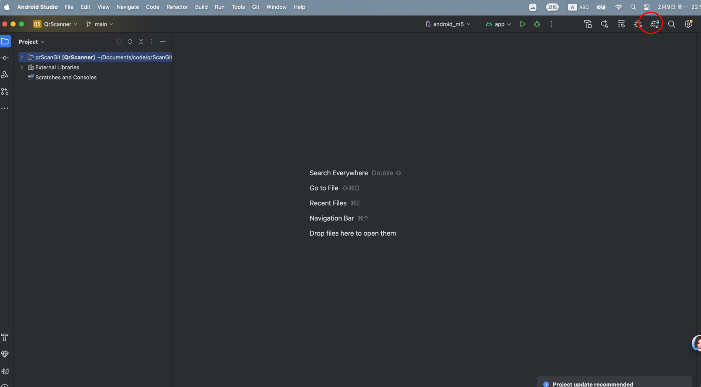

# how to 
### 1. git clone 

### 2. download 

### 3. launch emulator

### 4. AndroidStudio --> Run --> Run 'app'

### 5. wait 1min, app will be installed to emulator automatically and luanched

### 6. click button 'Scan', must select 'Allow' when 1st popup

### 7. put qrCode in front of camera

### 8. APP scanned successfullu

# 9. test 
###  1) demo: doc/scan_succeed.mp4
###  2) emulator setting: doc/emulator_setting_canScan.png (Front=Emulate; Back=Webcam0)

